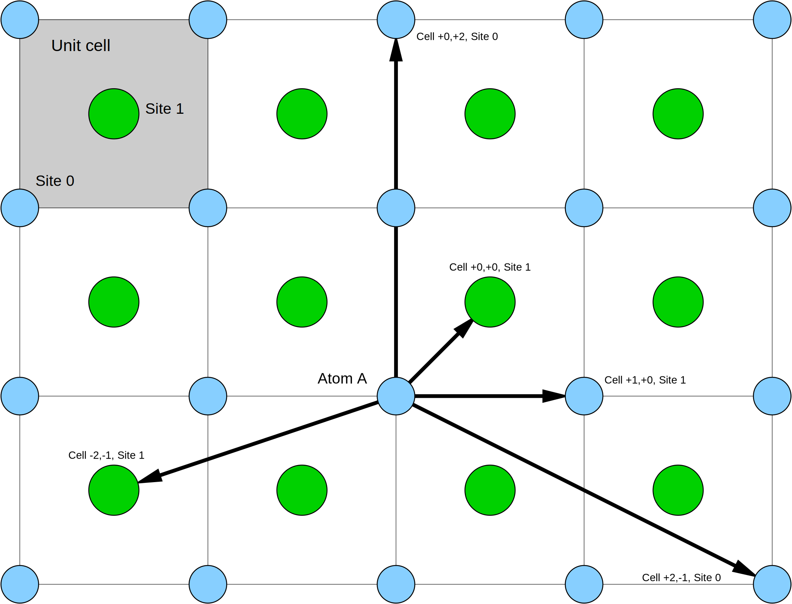

==================================
Neighbors definition in Javelin
==================================

The neighbors above are created in javelin by (starting at 12 o'clock
and working clockwise):

>>> from javelin.neighborlist import NeighborList
>>> nl = NeighborList([[0, 0, 0, 2, 0],
...                    [0, 1, 0, 0, 0],
...		       [0, 0, 1, 0, 0],
...                    [0, 0, 2,-1, 0],
...                    [0, 1,-2,-1, 0]])
>>> nl
NeighborList([[ 0  0  0  2  0]
              [ 0  1  0  0  0]
              [ 0  0  1  0  0]
              [ 0  0  2 -1  0]
              [ 0  1 -2 -1  0]])
>>> print(nl)
      |     site      |    vector
index | origin target |   i   j   k
    0 |      0      0 |   0   2   0
    1 |      0      1 |   0   0   0
    2 |      0      0 |   1   0   0
    3 |      0      0 |   2  -1   0
    4 |      0      1 |  -2  -1   0
